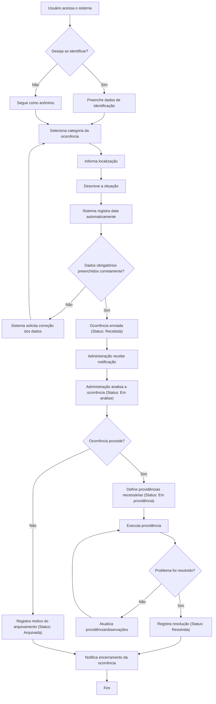
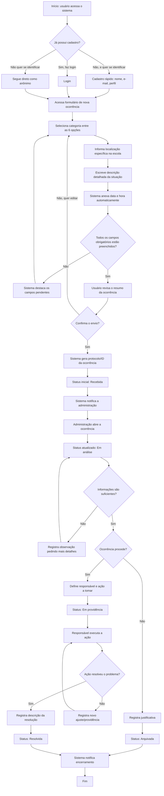
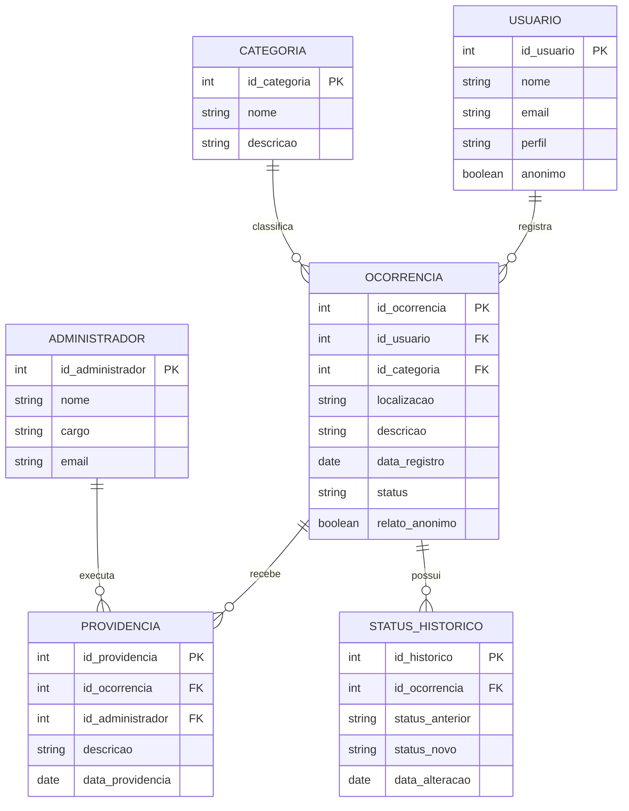
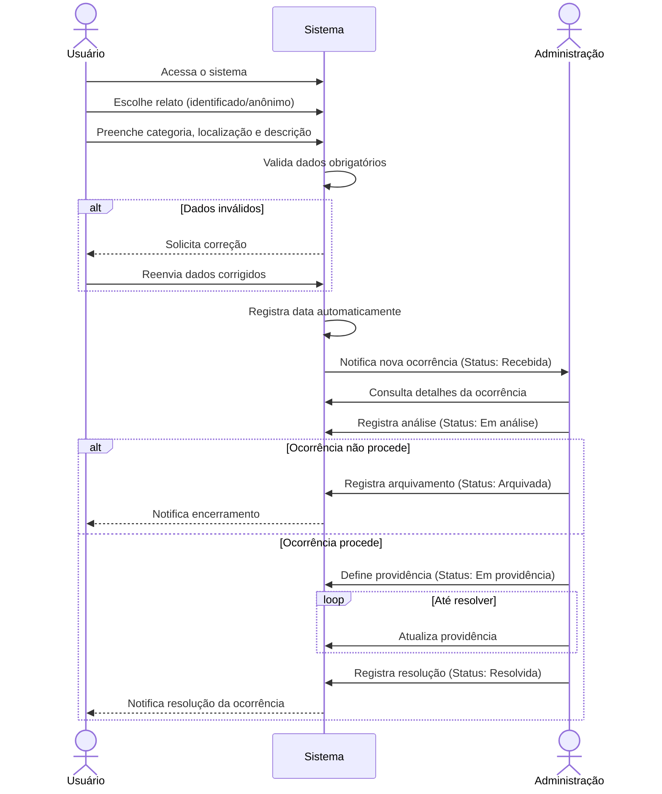
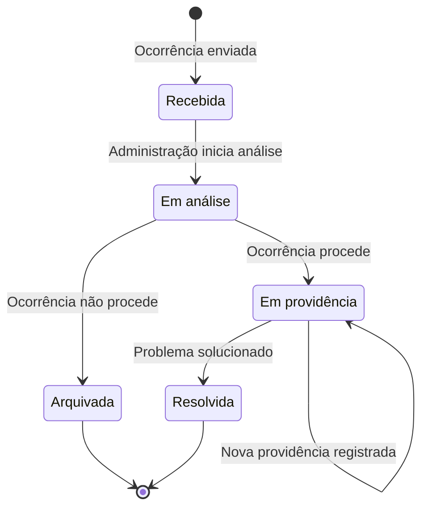

# Arquitetura do Sistema

## Sistema de Denúncias e Ocorrências Escolares — Etapa 2

Este documento reúne o **Diagrama de Fluxo com Regras de Negócio**, o **Modelo de Banco de Dados (ER)** e a **Estrutura de Pastas** do repositório, servindo como base para a fase de modelagem e desenvolvimento do sistema.

---

## 0. Diagrama de Fluxo do Processo Principal (Visão Geral)

O fluxo abaixo representa o caminho completo de uma ocorrência, desde o registro pelo usuário até a resolução final, incluindo pontos de decisão, validações, aprovações e retornos (loops de correção/acompanhamento). Este é o diagrama "macro" — a seção seguinte detalha cada uma dessas etapas passo a passo.

### Regras de negócio aplicadas ao fluxo

| Regra | Descrição |
|---|---|
| RN01 | O usuário deve escolher, antes de prosseguir, entre relato identificado ou anônimo. |
| RN02 | Todos os campos obrigatórios (categoria, localização, descrição) devem ser preenchidos; caso contrário, o sistema retorna a etapa de preenchimento. |
| RN03 | A data de registro é gerada automaticamente pelo sistema, não podendo ser editada pelo usuário. |
| RN04 | Toda ocorrência enviada entra automaticamente com status **Recebida**. |
| RN05 | Somente a administração pode alterar o status de uma ocorrência. |
| RN06 | Uma ocorrência analisada pode ser **arquivada** (caso não proceda) ou seguir para **providência**. |
| RN07 | Uma ocorrência pode receber mais de uma providência até ser considerada resolvida (loop de acompanhamento). |
| RN08 | A identidade do usuário anônimo nunca é exposta à administração durante o processo. |
| RN09 | O status **Resolvida** só pode ser atribuído após o registro da providência que solucionou o problema. |

---

## 1. Diagrama de Fluxo Detalhado (Passo a Passo)

Este segundo diagrama "abre" cada etapa do fluxo macro em ações menores e mais concretas — o tipo de detalhamento que ajuda na hora de desenhar as telas e as validações do sistema.

---

## 2. Modelo de Banco de Dados (Diagrama ER)

### Descrição das entidades

- **USUARIO** — armazena os dados de quem registra a ocorrência (quando identificado); o campo `anonimo` indica se o usuário optou por não se identificar.
- **OCORRENCIA** — entidade central; guarda categoria, localização, descrição, data, status atual e se o relato foi anônimo.
- **CATEGORIA** — lista as categorias possíveis (Estrutura, Segurança, Limpeza, Equipamentos, Situações inadequadas, Outros).
- **PROVIDENCIA** — registra cada ação tomada pela administração para tratar uma ocorrência; uma ocorrência pode ter várias providências.
- **ADMINISTRADOR** — responsável por analisar ocorrências e registrar providências.
- **STATUS_HISTORICO** — mantém o histórico de mudanças de status de cada ocorrência, permitindo rastrear todo o andamento (Recebida → Em análise → Em providência → Resolvida/Arquivada).

### Relacionamentos

- Um **usuário** pode registrar **várias ocorrências** (1:N).
- Uma **categoria** pode classificar **várias ocorrências** (1:N).
- Uma **ocorrência** pode ter **várias providências** (1:N).
- Uma **ocorrência** pode ter **vários registros no histórico de status** (1:N).
- Um **administrador** pode executar **várias providências** (1:N).

---

## 3. Diagrama de Sequência (Interação entre Usuário, Sistema e Administração)

Enquanto o fluxograma mostra o *processo* como um todo, o diagrama de sequência mostra *quem troca mensagens com quem* e em que ordem, deixando mais claro o papel de cada participante (Usuário, Sistema e Administração) durante o ciclo de vida de uma ocorrência.

**Explicação:** o diagrama deixa explícito que o Usuário só interage diretamente com o Sistema (nunca com a Administração), o que reforça a regra de preservação do anonimato (RN08). A Administração também só enxerga a ocorrência através do Sistema, nunca dados de identificação quando o relato é anônimo. Os blocos `alt` representam decisões (dados inválidos, ocorrência procede ou não) e o bloco `loop` representa o retorno/acompanhamento até a resolução — os mesmos pontos de decisão do fluxograma, agora vistos pela ótica da comunicação entre os atores.

---

## 4. Diagrama de Estados da Ocorrência

Como o status é o elemento central de acompanhamento do sistema, um diagrama de estados ajuda a visualizar exatamente quais transições são permitidas — evitando, por exemplo, que uma ocorrência "pule" de Recebida direto para Resolvida sem passar pela análise.

