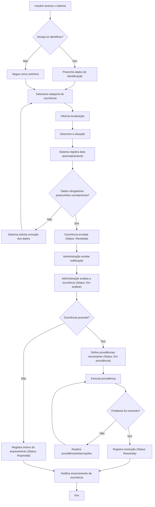
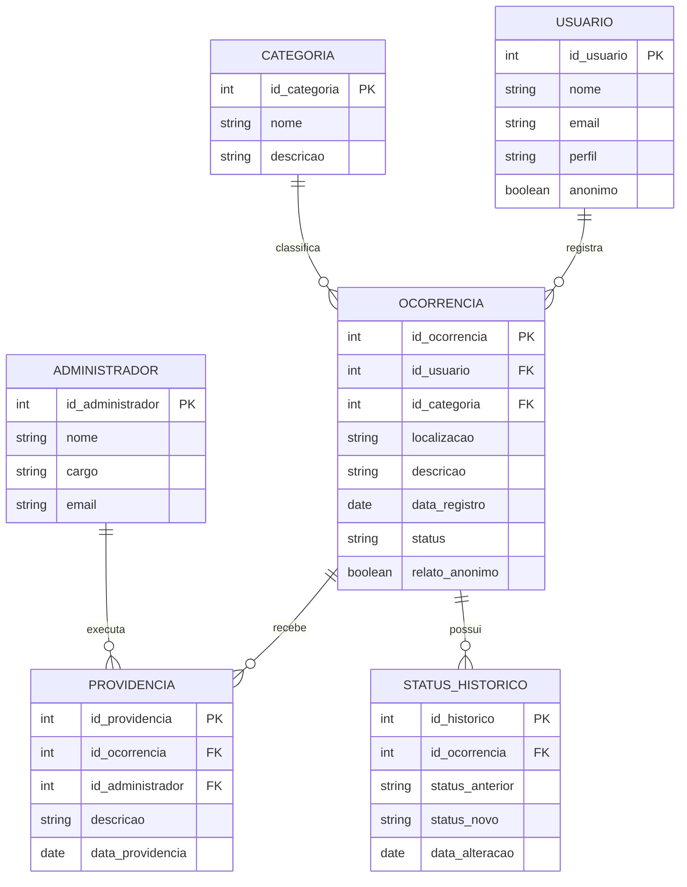

# Arquitetura do Sistema

## Sistema de Denúncias e Ocorrências Escolares — Etapa 2

Este documento reúne o **Diagrama de Fluxo com Regras de Negócio**, o **Modelo de Banco de Dados (ER)** e a **Estrutura de Pastas** do repositório, servindo como base para a fase de modelagem e desenvolvimento do sistema.

---

## 1. Diagrama de Fluxo do Processo Principal

O fluxo abaixo representa o caminho completo de uma ocorrência, desde o registro pelo usuário até a resolução final, incluindo pontos de decisão, validações, aprovações e retornos (loops de correção/acompanhamento).



### Regras de negócio aplicadas ao fluxo

| Regra | Descrição |
|---|---|
| RN01 | O usuário deve escolher, antes de prosseguir, entre relato identificado ou anônimo. |
| RN02 | Todos os campos obrigatórios (categoria, localização, descrição) devem ser preenchidos; caso contrário, o sistema retorna a etapa de preenchimento. |
| RN03 | A data de registro é gerada automaticamente pelo sistema, não podendo ser editada pelo usuário. |
| RN04 | Toda ocorrência enviada entra automaticamente com status **Recebida**. |
| RN05 | Somente a administração pode alterar o status de uma ocorrência. |
| RN06 | Uma ocorrência analisada pode ser **arquivada** (caso não proceda) ou seguir para **providência**. |
| RN07 | Uma ocorrência pode receber mais de uma providência até ser considerada resolvida (loop de acompanhamento). |
| RN08 | A identidade do usuário anônimo nunca é exposta à administração durante o processo. |
| RN09 | O status **Resolvida** só pode ser atribuído após o registro da providência que solucionou o problema. |

---

## 2. Modelo de Banco de Dados (Diagrama ER)



### Descrição das entidades

- **USUARIO** — armazena os dados de quem registra a ocorrência (quando identificado); o campo `anonimo` indica se o usuário optou por não se identificar.
- **OCORRENCIA** — entidade central; guarda categoria, localização, descrição, data, status atual e se o relato foi anônimo.
- **CATEGORIA** — lista as categorias possíveis (Estrutura, Segurança, Limpeza, Equipamentos, Situações inadequadas, Outros).
- **PROVIDENCIA** — registra cada ação tomada pela administração para tratar uma ocorrência; uma ocorrência pode ter várias providências.
- **ADMINISTRADOR** — responsável por analisar ocorrências e registrar providências.
- **STATUS_HISTORICO** — mantém o histórico de mudanças de status de cada ocorrência, permitindo rastrear todo o andamento (Recebida → Em análise → Em providência → Resolvida/Arquivada).

### Relacionamentos

- Um **usuário** pode registrar **várias ocorrências** (1:N).
- Uma **categoria** pode classificar **várias ocorrências** (1:N).
- Uma **ocorrência** pode ter **várias providências** (1:N).
- Uma **ocorrência** pode ter **vários registros no histórico de status** (1:N).
- Um **administrador** pode executar **várias providências** (1:N).

---

## 3. Estrutura de Pastas do Repositório

```text
Projeto_integrador_II/
│
├── README.md
│
├── docs/
│   ├── requisitos.md
│   ├── fluxograma.md
│   ├── prototipo.md
│   └── arquitetura.md
│
├── diagramas/
│   ├── fluxo-processo.mmd
│   └── modelo-er.mmd
│
└── src/
    └── README.md
```

**Descrição das pastas:**

- `docs/` — documentação textual do projeto (requisitos, fluxograma explicado, protótipo de telas e este arquivo de arquitetura).
- `diagramas/` — arquivos `.mmd` (Mermaid) isolados, para quem quiser renderizar os diagramas separadamente sem abrir o `arquitetura.md`.
- `src/` — reservada para o código-fonte do sistema, a ser desenvolvido nas próximas etapas.
- `README.md` (raiz) — apresentação geral do projeto, para quem acessar o repositório pela primeira vez.

---

## 4. Resumo da Etapa 2

Nesta etapa, o projeto avançou da definição conceitual (Etapa 1) para a modelagem técnica: o fluxo do processo foi detalhado com pontos de decisão e retorno, o banco de dados ganhou entidades adicionais para suportar histórico de status e responsáveis administrativos, e o repositório foi organizado para separar documentação, diagramas e código-fonte.
