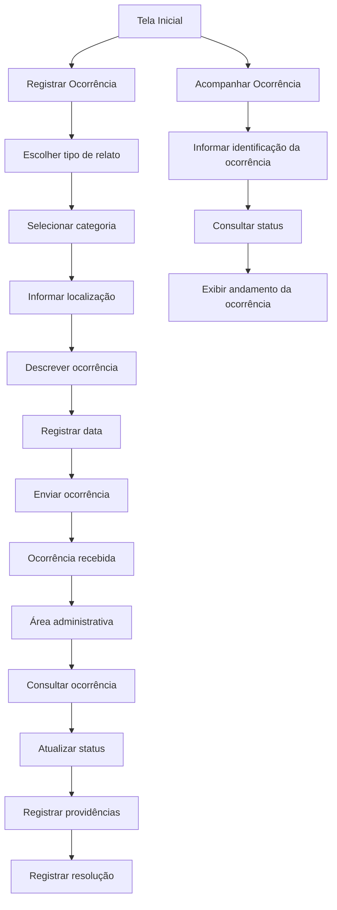

# Protótipo de Telas

## Sistema de Denúncias e Ocorrências Escolares

Este protótipo apresenta a estrutura inicial das principais telas do sistema, com base nos requisitos definidos na Etapa 1.

## 1. Fluxo das telas



## 2. Tela Inicial

```text
┌──────────────────────────────────────────────┐
│      SISTEMA DE DENÚNCIAS E OCORRÊNCIAS     │
│                   ESCOLARES                  │
├──────────────────────────────────────────────┤
│                                              │
│  Relate problemas e situações que precisam  │
│  da atenção da administração escolar.       │
│                                              │
│       ┌──────────────────────────┐           │
│       │   REGISTRAR OCORRÊNCIA   │           │
│       └──────────────────────────┘           │
│                                              │
│       ┌──────────────────────────┐           │
│       │  ACOMPANHAR OCORRÊNCIA   │           │
│       └──────────────────────────┘           │
│                                              │
└──────────────────────────────────────────────┘
```

## 3. Tela de Registro de Ocorrência

```text
┌──────────────────────────────────────────────┐
│           REGISTRAR OCORRÊNCIA               │
├──────────────────────────────────────────────┤
│                                              │
│ Categoria:                                   │
│ [ Estrutura e infraestrutura       ▼ ]       │
│                                              │
│ Local da ocorrência:                         │
│ [______________________________________]     │
│                                              │
│ Descrição:                                   │
│ [                                      ]     │
│ [                                      ]     │
│ [                                      ]     │
│                                              │
│ Data:                                        │
│ [____/____/________]                         │
│                                              │
│ Tipo de relato:                              │
│ ( ) Identificado    ( ) Anônimo              │
│                                              │
│       ┌──────────────────────────┐           │
│       │      ENVIAR RELATO       │           │
│       └──────────────────────────┘           │
│                                              │
└──────────────────────────────────────────────┘
```

## 4. Tela de Acompanhamento

```text
┌──────────────────────────────────────────────┐
│          ACOMPANHAR OCORRÊNCIA               │
├──────────────────────────────────────────────┤
│                                              │
│ Código da ocorrência:                        │
│ [____________________________]               │
│                                              │
│       ┌──────────────────────────┐           │
│       │        CONSULTAR         │           │
│       └──────────────────────────┘           │
│                                              │
│ Status:                                      │
│                                              │
│  ✓ Recebida                                  │
│  ✓ Em análise                                │
│  ○ Em providência                            │
│  ○ Resolvida                                 │
│                                              │
└──────────────────────────────────────────────┘
```

## 5. Área Administrativa

```text
┌──────────────────────────────────────────────┐
│          ÁREA ADMINISTRATIVA                 │
├──────────────────────────────────────────────┤
│                                              │
│ Ocorrências registradas:                     │
│                                              │
│ ┌──────────────────────────────────────────┐ │
│ │ #001 | Segurança | Em análise            │ │
│ ├──────────────────────────────────────────┤ │
│ │ #002 | Estrutura | Em providência        │ │
│ ├──────────────────────────────────────────┤ │
│ │ #003 | Equipamentos | Resolvida          │ │
│ └──────────────────────────────────────────┘ │
│                                              │
│ Status:                                      │
│ [ Em análise ▼ ]                             │
│                                              │
│ Providências:                                │
│ [______________________________________]     │
│                                              │
│       ┌──────────────────────────┐           │
│       │   ATUALIZAR OCORRÊNCIA   │           │
│       └──────────────────────────┘           │
│                                              │
└──────────────────────────────────────────────┘
```

## 6. Status das ocorrências

Os status definidos para as ocorrências são:

- Recebida;
- Em análise;
- Em providência;
- Resolvida.

As cores poderão ser utilizadas para facilitar a identificação visual:

- 🟢 Resolvida;
- 🟡 Em análise;
- 🔴 Não concluída.
